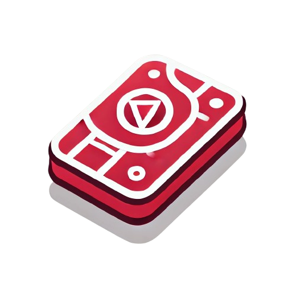

  [![Contributors][contributors-shield]][contributors-url]
  [![Forks][forks-shield]][forks-url]
  [![Stargazers][stars-shield]][stars-url]
  [![Issues][issues-shield]][issues-url]
  [![MIT License][license-shield]][license-url]

 

  <a href="https://github.com/petebarbosa/anki-on-rails">
    <logo></logo>
  </a>

<h1 align="center">Anki on Rails</h1>
<h4 align="center">A free, community-driven flashcard tool for fun and effective studying, with no paywalls, ever!</h4>

  

    <a href="https://github.com/petebarbosa/anki-on-rails/issues/new?labels=bug&template=bug-report---.md">Report Bug</a>
    ·
    <a href="https://github.com/petebarbosa/anki-on-rails/issues/new?labels=enhancement&template=feature-request---.md">Request Feature</a>
  

  
Table of Contents

  <ol>
    <li>
      <a href="#about-the-project">About The Project</a>
      <ul>
        <li><a href="#built-with">Built With</a></li>
      </ul>
    </li>
    <li><a href="#roadmap">Roadmap</a></li>
    <li>
      <a href="#getting-started">Getting Started</a>
      <ul>
        <li><a href="#prerequisites">Prerequisites</a></li>
        <li><a href="#installation">Installation</a></li>
      </ul>
    </li>
    <li><a href="#contributing">Contributing</a></li>
    <li><a href="#license">License</a></li>
    <li><a href="#contact">Contact</a></li>
    <!-- <li><a href="#acknowledgments">Acknowledgments</a></li> -->
  </ol>

## About The Project

A free Anki tool for your improvement. Dive into this easy-to-use flashcard app and have fun learning. Anki on Rails is all about community—share your ideas or help us improve the app together. No paywalls here, we believe studying should be accessible for everyone. Join us in making learning better for everyone!

(<a href="#readme-top">back to top</a>)

### Built With

 - ![Rails]
 - ![Tailwind]
 - ![Stimulus]
 - ![Hotwire]
 - ![Turbo]
 - ![Postgres]

(<a href="#readme-top">back to top</a>)

## Roadmap

For now these are not in some kind of development order. It's more like a to-do list, of some sort.

- [ ] Image uploading for cards
- [ ] (mobile) Cards based on screen orientation
- [ ] Import cards with text files
- [ ] A more welcoming home page
- [ ] Other languages support
- [ ] Digital pen writing
  <!-- - [ ] Nested Feature -->

See the [open issues](https://github.com/petebarbosa/anki-on-rails/issues) for a full list of proposed features (and known issues).

(<a href="#readme-top">back to top</a>)

## Getting Started

### Prerequisites

Coming soon.

### Installation

Coming soon.

(<a href="#readme-top">back to top</a>)

## Contributing

Contributions are what make the open source community such an amazing place to learn, inspire, and create. Any contributions you make are **greatly appreciated**.

If you have a suggestion that would make this better, please fork the repo and create a pull request. You can also simply open an issue with the tag "enhancement".
Don't forget to give the project a star! Thanks again!

1. Fork the Project
2. Create your Feature Branch (`git checkout -b feature/amazing-feature`)
3. Commit your Changes (`git commit -m 'Add some amazing_feature'`)
4. Push to the Branch (`git push origin feature/amazing-feature`)
5. Open a Pull Request

(<a href="#readme-top">back to top</a>)

### Top contributors:

## License

Distributed under the MIT License. See `LICENSE.txt` for more information.

(<a href="#readme-top">back to top</a>)

<!-- CONTACT -->
## Contact

Pedro Barbosa 

Project Link: coming soon.

[![LinkedIn][linkedin-shield]][linkedin-url]

(<a href="#readme-top">back to top</a>)

<!-- ACKNOWLEDGMENTS 
## Acknowledgments

* 
* 
* 

(<a href="#readme-top">back to top</a>)

-->

<!-- MARKDOWN LINKS, IMAGES & STYLES -->
[contributors-shield]: https://img.shields.io/github/contributors/petebarbosa/anki-on-rails.svg?style=for-the-badge
[contributors-url]: https://github.com/petebarbosa/anki-on-rails/graphs/contributors
[forks-shield]: https://img.shields.io/github/forks/petebarbosa/anki-on-rails.svg?style=for-the-badge
[forks-url]: https://github.com/petebarbosa/anki-on-rails/network/members
[stars-shield]: https://img.shields.io/github/stars/petebarbosa/anki-on-rails.svg?style=for-the-badge
[stars-url]: https://github.com/petebarbosa/anki-on-rails/stargazers
[issues-shield]: https://img.shields.io/github/issues/petebarbosa/anki-on-rails.svg?style=for-the-badge
[issues-url]: https://github.com/petebarbosa/anki-on-rails/issues
[license-shield]: https://img.shields.io/github/license/petebarbosa/anki-on-rails.svg?style=for-the-badge
[license-url]: https://github.com/petebarbosa/anki-on-rails/blob/master/LICENSE.txt
[linkedin-shield]: https://img.shields.io/badge/LinkedIn-0A66C2.svg?style=for-the-badge&logo=LinkedIn&logoColor=white
[linkedin-url]: https://www.linkedin.com/in/pvbb250689/
[Rails]: https://img.shields.io/badge/Ruby%20on%20Rails-D30001.svg?style=for-the-badge&logo=Ruby-on-Rails&logoColor=white
[Tailwind]: https://img.shields.io/badge/Tailwind%20CSS-06B6D4.svg?style=for-the-badge&logo=Tailwind-CSS&logoColor=white
[Stimulus]: https://img.shields.io/badge/Stimulus-77E8B9.svg?style=for-the-badge&logo=Stimulus&logoColor=black
[Hotwire]: https://img.shields.io/badge/Hotwire-FFE801.svg?style=for-the-badge&logo=Hotwire&logoColor=black
[Turbo]: https://img.shields.io/badge/Turbo-5CD8E5.svg?style=for-the-badge&logo=Turbo&logoColor=black
[Postgres]: https://img.shields.io/badge/PostgreSQL-4169E1.svg?style=for-the-badge&logo=PostgreSQL&logoColor=white

